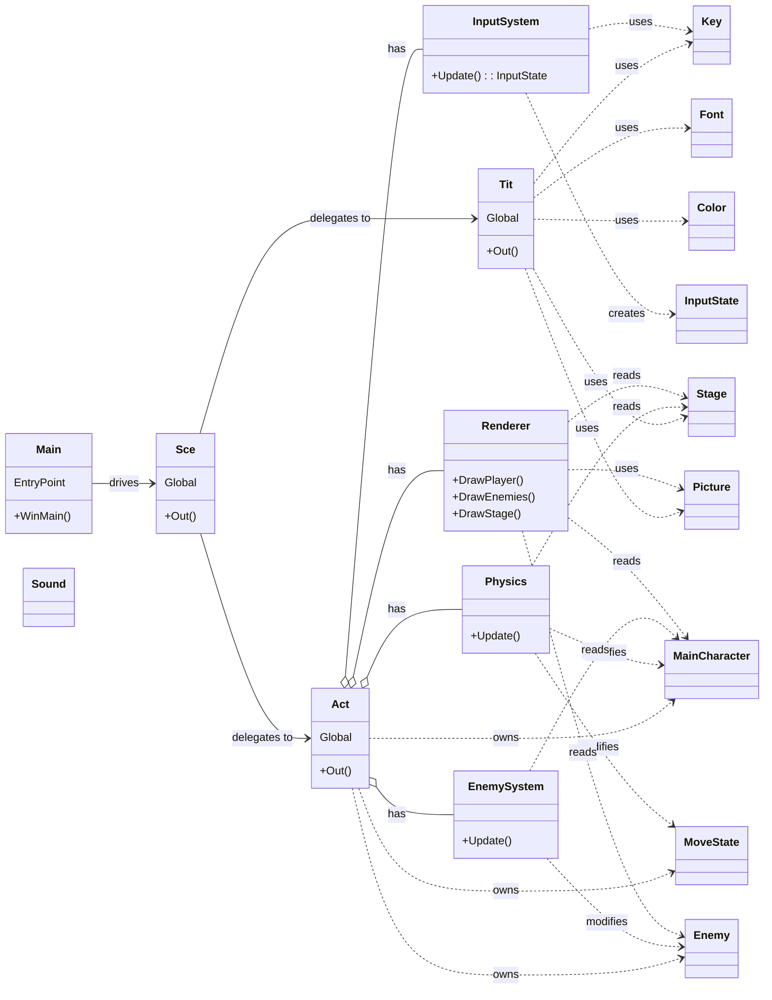

# DxLib 2D Action Game – Refactoring & Design Improvement

## 概要

本プロジェクトは、DxLibを用いた2D横スクロールアクションゲームを題材に、
**既存コードの設計上の問題点を洗い出し、仕様修正および構造改善を行ったリファクタリングプロジェクト**です。

このゲームは以下の記事を題材として、改良を行いました。

https://qiita.com/nekoshiki0904/items/0d5bc01b6d1ac6d29495

単なる機能追加ではなく、

* 座標系設計の破綻
* ロジックと描画の密結合
* 1クラス集中型設計
* 入力依存ロジック

といった、**ゲームプログラムとして致命的になり得る設計課題を段階的に修正**し、
「動くコード」から「拡張可能な構造」へ改善することを目的としました。

## Demo

### Before (original)


### After (refactored)


---

## 実施内容サマリ

本プロジェクトで行った主な改善は以下です。

1. 敵AIの仕様修正（入力依存 → 独立AI）
2. 座標系設計の再構築（スクリーン / ワールド / カメラ）
3. Renderer 分離（描画責務の独立）
4. Physics 分離（物理演算ロジックの独立）
5. EnemySystem 分離（敵AI責務の独立）
6. InputSystem 分離（入力とゲームロジックの分離）
7. Action クラスの可読性・構造改善

---

## 1. 敵AI仕様の問題と修正

### 問題

元コードでは、敵の移動速度がプレイヤー入力に依存しており、

* プレイヤーがジャンプ中 → 敵の動きが不安定になる(ジャンプ移動中、進行方向と逆向きの敵が少し固まる)
* プレイヤーの操作次第で敵AIの挙動が変わる

という、本来あるべきでない依存関係が存在していました。

### 改善

敵自身が移動速度パラメータを持つ設計に変更し、

* 敵は敵として独立したAI挙動を持つ
* プレイヤー状態と無関係に動作する

構造に修正しました。

また、敵の動きの改善として、

- 敵同士の衝突判定を実装し、敵同士がすり抜けないように
- 敵の移動速度に加速度を持たせ、敵とプレイヤーが等速で動かないように

実装しました。

---

## 2. 座標系設計の破綻と再構築

### 問題①：座標系の混在

元コードでは：

プレイヤー：画面座標
マップ：画面座標
敵：画面座標

と全部一致していましたが、

途中で敵だけワールド座標に変更してしまったため、

・プレイヤーがジャンプ左右移動をしたとき、敵もその流れに合わせて移動する
・プレイヤーが進行不能になる

といった不可解なバグが頻発していました。

### 改善

すべての判定処理を

> 画面座標 → ワールド座標 → ステージ参照

という形に統一し、
**論理座標と描画座標を明確に分離**しました。

---

### 問題②：敵が画面外に取り残される

敵の座標をワールド固定にした結果、

* プレイヤーが進むと敵が画面外に消える
* 追いかけてこない

という問題が発生。

原因は、

> 敵の行動範囲だけがスクリーン座標基準のままだったこと

でした。

### 改善

敵の行動範囲もカメラ基準に変換し、

> 敵：ワールド座標
> 行動範囲：カメラ基準ワールド

という形で統一。

---

## 3. Renderer 分離（描画責務の独立）

### 課題

描画処理（DrawGraph / DrawString 等）が
ゲームロジック中に直接書かれており、

* 処理の流れが追えない
* テスト不能
* 変更時に副作用が発生しやすい

構造でした。

### 改善

Renderer クラスを作成し、

```cpp
renderer.DrawStage();
renderer.DrawPlayer();
renderer.DrawEnemies();
renderer.DrawUI();
```

Action は「何を描くか」だけ指示し、
「どう描くか」は知らない構造に変更。

---

## 4. Physics 分離（物理演算の独立）

ジャンプ、重力、落下判定などの物理計算が
Action 内に混在していたため、

```cpp
physics.Update(MainChar, Mov, Sta_PosX, Sta);
```

という形で Physics クラスに分離。

Action は状態を渡すだけの構造に。

---

## 5. EnemySystem 分離

敵の移動ロジック・衝突判定を EnemySystem に集約。

```cpp
enemySystem.Update(Enemies, MainChar, Sta_PosX);
```

敵AIが Action から完全に切り離され、
将来的な敵追加・AI変更が容易な構造に。

---

## 6. InputSystem 分離

入力処理を直接ロジックで参照していた構造から、

```cpp
InputState in = inputSystem.Update();
```

という形に変更。

Action 側は、

```cpp
if (in.moveRight) ...
if (in.jump) ...
```

のように**意味的入力のみを参照**。

デバイス依存が完全に隔離されました。

---

## 7. Action クラスの構造改善

最終的に Action は以下の構造に整理されました。

```cpp
Update();
Judge();
Cal();
Draw();
```

1フレームの処理が完全に可視化され、

* Update：状態更新
* Judge：入力・衝突判定
* Cal：物理・AI計算
* Draw：描画

という**ゲームループとして理想的な構造**に。

---
## クラス構成図


---

## このプロジェクトで得た知見

本プロジェクトを通して、以下を強く実感しました。

* 「動くコード」と「育てられる構造」は別物
* バグの多くはロジックではなく**設計の歪み**から生まれる
* クラスとは「データの箱」ではなく「意味のある責務単位」
* 座標系設計はゲームプログラムの基盤

---

## 技術スタック

* C++
* DxLib
* Visual Studio

---

# 追記

## 8. ヘッダファイル分離と依存関係整理

### 課題：Sub.h による神ヘッダ構成

リファクタリング初期段階では、以下のような構造を採用していました。

```cpp
// Sub.h
class { ... } Key;
class { ... } Font;
class { ... } Color;
class { ... } FPS;
class { ... } Sound;
class { ... } Picture;
```

いわゆる **「神ヘッダファイル」構成** であり、

* 無名クラス＋グローバル実体
* .h に実装が直書き
* どこからでもアクセス可能
* 型として扱えない
* IntelliSense が破綻する

という、**小規模では動くが拡張不能な構造**でした。

---

### 問題点

この構成には以下の深刻な問題がありました。

| 問題              | 実害        |
| --------------- | --------- |
| グローバル変数         | 依存関係が見えない |
| 無名クラス           | 型として使えない  |
| .h に実装          | ビルド時間増大   |
| include 集中      | 循環依存の温床   |
| IntelliSense 崩壊 | エディタ補完不能  |

特に、

> **「動くが、設計としては破綻している」**

という状態に陥っていました。

---

### 改善方針

以下の方針で再設計を行いました。

1. 1クラス1ファイル
2. .h には宣言のみ
3. 実体は必ず .cpp に置く
4. グローバル実体は極力排除
5. 依存方向は一方向のみ

---

### 実施内容

Sub.h を完全解体し、以下の system 層に分離。

```
system/
    Key.h / Key.cpp
    FPS.h / FPS.cpp
    Font.h / Font.cpp
    Color.h / Color.cpp
    Sound.h / Sound.cpp
    Picture.h / Picture.cpp
```

すべて以下の形式に統一：

```cpp
// Font.h
class FontClass {
public:
    void Read();
};

extern FontClass Fon;
```

```cpp
// Font.cpp
FontClass Fon;
```

---

### InputSystem / Physics / Renderer の分離

さらにロジック層についても、

* InputSystem
* Physics
* Renderer
* EnemySystem

をそれぞれ独立クラスとして分離し、

Action は以下のような **司令塔構造** に変更。

```cpp
class Action {
    Renderer* renderer;
    Physics* physics;
    EnemySystem* enemySystem;
    InputSystem* inputSystem;
};
```

Action 自体は処理を行わず、

> 「どの順番で何を呼ぶか」
> だけを管理する構造に。

---

### Scene による所有関係の整理

以前は Action がグローバル実体として存在していました。

```cpp
Act.Out(); // グローバル呼び出し
```

これを、

```cpp
class Scene {
    Action act;
};
```

という形に変更し、

```
main
 └ Scene
      └ Action
```

という **正しい所有関係** を構築。

グローバル状態を完全排除しました。

---

### 分離後に得られた効果

| Before     | After   |
| ---------- | ------- |
| 神ヘッダ       | レイヤ構造   |
| グローバル乱立    | Scene管理 |
| include 地獄 | 一方向依存   |
| 型崩壊        | 型安全     |
| 修正怖い       | 修正安全    |
| テスト不能      | 単体テスト可能 |

---

### この工程で得た最重要知見

このリファクタリングを通して強く実感したのは、

> **「バグの多くはロジックではなく、設計の歪みから生まれる」**

という点でした。

ヘッダ分離後は、

* エラーの原因が即座に特定できる
* 変更箇所の影響範囲が明確
* クラスの役割が自然に説明できる

状態になり、

> 「動くコード」から
> **「育てられる構造」へ移行できた**

と実感しています。

---

## 追記のまとめ

> * 大規模化するほど、実装よりも「依存関係の設計」が重要になる
> * ヘッダファイルは「便利にまとめるもの」ではなく「責務を切り分けるための境界線」


