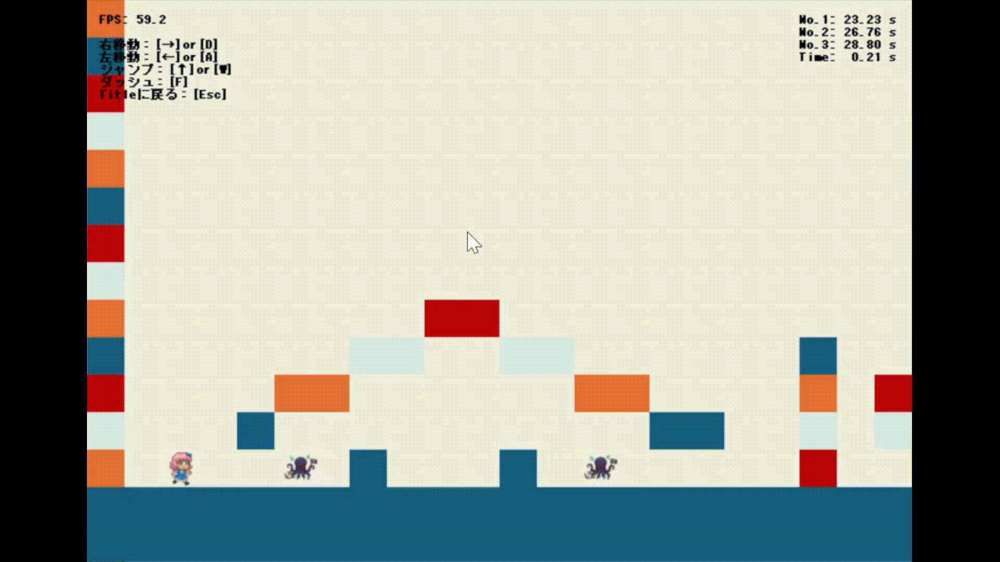

# DxLib 2D Action Game – Refactoring & Design Improvement

## 概要

本プロジェクトは、DxLibを用いた2D横スクロールアクションゲームを題材に、
**既存コードの設計上の問題点を洗い出し、仕様修正および構造改善を行ったリファクタリングプロジェクト**です。

このゲームは以下の記事を題材として、改良を行いました。

https://qiita.com/nekoshiki0904/items/0d5bc01b6d1ac6d29495

単なる機能追加ではなく、

* 座標系設計の破綻
* ロジックと描画の密結合
* 1クラス集中型設計
* 入力依存ロジック

といった、**ゲームプログラムとして致命的になり得る設計課題を段階的に修正**し、
「動くコード」から「拡張可能な構造」へ改善することを目的としました。

## Demo

### Before (original)


### After (refactored)


---

## 実施内容サマリ

本プロジェクトで行った主な改善は以下です。

1. 敵AIの仕様修正（入力依存 → 独立AI）
2. 座標系設計の再構築（スクリーン / ワールド / カメラ）
3. Renderer 分離（描画責務の独立）
4. Physics 分離（物理演算ロジックの独立）
5. EnemySystem 分離（敵AI責務の独立）
6. InputSystem 分離（入力とゲームロジックの分離）
7. Action クラスの可読性・構造改善

---

## 1. 敵AI仕様の問題と修正

### 問題

元コードでは、敵の移動速度がプレイヤー入力に依存しており、

* プレイヤーがジャンプ中 → 敵の動きが不安定になる(ジャンプ移動中、進行方向と逆向きの敵が少し固まる)
* プレイヤーの操作次第で敵AIの挙動が変わる

という、本来あるべきでない依存関係が存在していました。

### 改善

敵自身が移動速度パラメータを持つ設計に変更し、

* 敵は敵として独立したAI挙動を持つ
* プレイヤー状態と無関係に動作する

構造に修正しました。

また、敵の動きの改善として、

- 敵同士の衝突判定を実装し、敵同士がすり抜けないように
- 敵の移動速度に加速度を持たせ、敵とプレイヤーが等速で動かないように

実装しました。

---

## 2. 座標系設計の破綻と再構築

### 問題①：座標系の混在

元コードでは：

プレイヤー：画面座標
マップ：画面座標
敵：画面座標

と全部一致していましたが、

途中で敵だけワールド座標に変更してしまったため、

・プレイヤーがジャンプ左右移動をしたとき、敵もその流れに合わせて移動する
・プレイヤーが進行不能になる

といった不可解なバグが頻発していました。

### 改善

すべての判定処理を

> 画面座標 → ワールド座標 → ステージ参照

という形に統一し、
**論理座標と描画座標を明確に分離**しました。

---

### 問題②：敵が画面外に取り残される

敵の座標をワールド固定にした結果、

* プレイヤーが進むと敵が画面外に消える
* 追いかけてこない

という問題が発生。

原因は、

> 敵の行動範囲だけがスクリーン座標基準のままだったこと

でした。

### 改善

敵の行動範囲もカメラ基準に変換し、

> 敵：ワールド座標
> 行動範囲：カメラ基準ワールド

という形で統一。

---

## 3. Renderer 分離（描画責務の独立）

### 課題

描画処理（DrawGraph / DrawString 等）が
ゲームロジック中に直接書かれており、

* 処理の流れが追えない
* テスト不能
* 変更時に副作用が発生しやすい

構造でした。

### 改善

Renderer クラスを作成し、

```cpp
renderer.DrawStage();
renderer.DrawPlayer();
renderer.DrawEnemies();
renderer.DrawUI();
```

Action は「何を描くか」だけ指示し、
「どう描くか」は知らない構造に変更。

---

## 4. Physics 分離（物理演算の独立）

ジャンプ、重力、落下判定などの物理計算が
Action 内に混在していたため、

```cpp
physics.Update(MainChar, Mov, Sta_PosX, Sta);
```

という形で Physics クラスに分離。

Action は状態を渡すだけの構造に。

---

## 5. EnemySystem 分離

敵の移動ロジック・衝突判定を EnemySystem に集約。

```cpp
enemySystem.Update(Enemies, MainChar, Sta_PosX);
```

敵AIが Action から完全に切り離され、
将来的な敵追加・AI変更が容易な構造に。

---

## 6. InputSystem 分離

入力処理を直接ロジックで参照していた構造から、

```cpp
InputState in = inputSystem.Update();
```

という形に変更。

Action 側は、

```cpp
if (in.moveRight) ...
if (in.jump) ...
```

のように**意味的入力のみを参照**。

デバイス依存が完全に隔離されました。

---

## 7. Action クラスの構造改善

最終的に Action は以下の構造に整理されました。

```cpp
Update();
Judge();
Cal();
Draw();
```

1フレームの処理が完全に可視化され、

* Update：状態更新
* Judge：入力・衝突判定
* Cal：物理・AI計算
* Draw：描画

という**ゲームループとして理想的な構造**に。

---

## このプロジェクトで得た知見

本プロジェクトを通して、以下を強く実感しました。

* 「動くコード」と「育てられる構造」は別物
* バグの多くはロジックではなく**設計の歪み**から生まれる
* クラスとは「データの箱」ではなく「意味のある責務単位」
* 座標系設計はゲームプログラムの基盤

---

## 技術スタック

* C++
* DxLib
* Visual Studio

---


